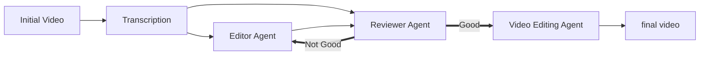
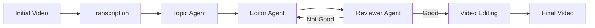

Like everyone and their grandmother, these days I am into Agents! I finally got to spend some time learning more about multi-agent workflows: I came up with a simple use case, built a first iteration and watched it shatter against the messy reality. Then I learned a few things.

This post shares three things learned: lost-in-the-middle, the bias compound problem, and that Whisper isn't a silver bullet.

The tool I built sort of works and is available on [GitHub](https://github.com/StefanoPetrilli/AgenticVideoEditor). The whole thing is a multi-agent video editor which takes a video and outputs a shortened down version by removing all the fluff so just the juicy parts remain.

Don't expect production ready magic, but I find it pretty entertaining :).

## Naive solution

The first naive solution that came to my mind is the following:

The plan: take a video, run it through a speech-to-text model to get the transcription, feed the full video transcript into an editor agent that decides what the most important segments are, then feed the full transcript and the selected segments to a Reviewer Agent tasked with deciding whether the selected sections of the video actually preserve the message.
In this plan, the editor agent and the reviewer agent would go back and forth until the reviewer agent agrees with the selection made by the editor agent.
Finally, FFmpeg stitches the final video together.

On paper? Flawless.
In reality? The output looked terrible 🥹.

You can look at it yourself:

  

    <h3>Original</h3>
    <iframe src="https://www.youtube.com/embed/tvL4FF2lMnw" frameborder="0" allowfullscreen></iframe>
  

  

    <h3>First iteration version</h3>
    <iframe src="https://www.youtube.com/embed/ZI_BlwMbuKI" frameborder="0" allowfullscreen></iframe>
  

The rest of the post is about what went wrong and what I learned.

## Lessons learned:

### Loss-in-the-middle
A 2024 paper, [_Lost in the Middle: how Language Models Use Long Contexts_](https://arxiv.org/pdf/2307.03172), documents that models oversample the beginning and the end of their context window and are less efficient at retrieving information from the middle of their context window.

What this paper formally proves won't surprise the OG ChatGPT 3.5 users who, in one way or another, already experienced this firsthand.
2026 is a different geological era in comparison to 2024 in the LLM world and this defect became much less noticeable as models became better and can juggle longer context windows. Still, _Lost-in-the-middle_ is inherent to transformer architectures so the problem remains.

It's also difficult to report on more recent literature on this topic. LLMs aren't a moving target, they're a running target. Every finding achieved might be obsolete the moment a new model generation comes out.
The most recent literature found on the topic comes from the paper [_LongFuncEval: Measuring the effectiveness of long context models for function calling_](https://arxiv.org/pdf/2505.10570)  where appendix F is entirely dedicated to measuring this on the SOTA of May 2025. Empirically, the lost-in-the-middle is still here and kicking, at least with the models tested on this project: DeepSeek V4 flash, Qwen 3.7, and GLM 4.7.

The editor agent from the workflow is the perfect storm for _lost-in-the-middle_. The videos tested on the workflow are quite long. Often, the real theme hides under a pile of fluff and exactly in the areas where the models are less sensitive: around the middle.
This is partially because often, the creator makes a short summary of the content at the beginning of the video. So the LLM, which by design oversamples that part, easily decides that the introductory summary is everything the user needs to know.
Often the opposite is actually true. The initial summary often brings very little value and the middle is the juicy part that interests the user.

This resulted in the editor agent always oversampling the introduction or the end of the video.
The solution was to modify the architecture to add one more node in the workflow. The new agent receives the whole transcript and finds the core message from it. Then the agent passes that along to the editor and to the reviewer in the format of [core message] + [full transcript] + [core message]. This idea came from reading the original _lost-in-the-middle_ paper.

I had zero expectation for it to work. In testing, the output stopped to over sampling the beginning of the videos.

### The compound bias problem:

The initial assumption for the workflow was that the Editor and the Reviewer would debate and iterate before coming to an agreement. What really happened is that the reviewer agent acted as a rubber stamper. It was basically always approving the findings of the editor.

I peeked at the literature and what I discovered is elegantly summarized by this quote: "LLMs' inherent sycophancy can collapse debates into premature consensus, potentially undermining the benefits of multi-agent debate. Sycophancy is a core failure mode that amplifies disagreement collapse before reaching a correct conclusion" which comes from the paper [_Peacemaker or Troublemaker: how Sycophancy Shapes Multi-Agent Debate_](https://arxiv.org/pdf/2509.23055).
The other paper consulted on the topic is [_Limits of Self-Correction in LLMs: an Information-Theoretic Analysis of Correlated Errors_](https://www.techrxiv.org/doi/full/10.36227/techrxiv.176834656.66652387/v2) which has a much more mathematical perspective on the matter. The background knowledge isn't sufficient to judge whether the mathematical aspect of the paper is sound, but the core argument seems sound: when evaluator error couples with generator error, self-evaluation becomes non-identifying and agreement provides negligible evidence of correctness.
This is a rabbit hole on its own. It could use its own blog post.

A straightforward solution to this was to use a different LLM model family for Editor and Reviewer agent. Basically, the biases of one model are just compounded if it's asked to judge the output of another instance of itself. When the models are different, the biases balance out. From my experience when using DeepSeek V4 Flash for both the Editor and Reviewer, the reviewer never rejected the first proposal. As soon as I switched the reviewer to a different model, the reviewer started rejecting the first proposal.

### Whisper isn't a silver bullet

Because Whisper it's on everyone's lips, I was under the assumption that it would be the best model for my task.

Training for Whisper models uses massive amounts of unsupervised data and much of this data comes from internet videos with subtitles, as explain in the [original Whisper paper](https://arxiv.org/pdf/2212.04356). It's a known opinion in the LLM communicty that training on this kind of data conditioned this model to chop text based on the visual constraints of a screen and acoustic pauses, rather than grammatical boundaries.

I also discovered that Whisper models are notoriously weak at timestamping the sentences they transcribe.
Having timestamps which aren't perfectly aligned in my workflow often resulted in chopped words. Another consequence is that the speech to text would sometimes split a single logical sentence in two parts if the speaker took a breath mid-sentence or paused for emphasis.

Using [WhisperX](https://arxiv.org/abs/2303.00747) solves some of Whisper's weak points. WhisperX integrates Whisper into a longer pipeline and results in better timestamping and sentence splitting. Because it didn't integrate easily with my stack and seemed a bit tricky to set up, ultimately my choice felt on [Vosk](https://alphacephei.com/vosk/). Empirically, the Vosk models produces output that's qualitatively similar to Whisper while using Acoustic Alignment for better timestamping and Voice Activity Detection to split the sentences in a reasonable way.

After hearing wonderful things about Whisper for months, it was quite a surprise that it was swiftly beaten in this specific use case by an underdog previously unheard of.

### Reworked architecture

Beaten up but not defeated, this is the resulting architecture after the changes.

And this is the resulting video:

  

    <h3>Original</h3>
    <iframe src="https://www.youtube.com/embed/tvL4FF2lMnw" frameborder="0" allowfullscreen></iframe>
  

  

    <h3>Version after the fixes</h3>
    <iframe src="https://www.youtube.com/embed/ViYfFg4JEgQ" frameborder="0" allowfullscreen></iframe>
  

This one is much better and does a great job at preserving the main narrative.
