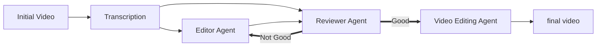
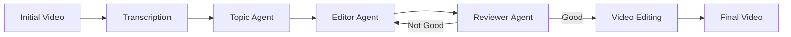

Like everyone and their grandmother these days, I am into Agents! More as a user than as a creator so far, but I finally got to spend a weekend learning more about multi-agent workflows. I came up with a simple use case, and started building. As soon as the workflow I first came up with hit the messy reality, it broke down. Everything was broken. As I kept tinkering and exploring, my understanding and the workflow architecture evolved with it.

In this blog post I want to share the three things I learned this weekend: lost-in-the-middle, the bias compound problem, and that Whisper is not a silver bullet.

The thing that I set out to build sort of works and you can find the repo on [GitHub](https://github.com/StefanoPetrilli/AgenticVideoEditor) if you want to try it. The whole thing is a multi-agent video editor which takes a video and outputs a shortened down version of the initial video tryign to remove all the fluff so you can just watch the juicy parts. The current version kinda works but do not expect anything production ready. It is very funny though.

## Naive solution

The first naive solution which came to my mind is the following:

I would take a video, run it through a speech to text model to get the transcription, feed the full video transcript into an editor agent tasked with deciding what the most important segments are, then I would feed the topic and the full transcript to a Reviewer Agent which is tasked to decide whether the selected sections of the video actually preserve the message.
In my plan, the editor agent and the reviewer agent would go back and forth until the reviewer agent agrees with the selection made by the editor agent.
Finally the video is assembled using FFMpeg.

If you are curious to look at the end result of this first version, here is the original video and the output of this naive workflow side by side:

Spoiler Alert: it's not good.

  

    <h3>Original</h3>
    <iframe width="100%" height="315" src="https://www.youtube.com/embed/tvL4FF2lMnw" frameborder="0" allowfullscreen></iframe>
  

  

    <h3>First Iteration Version</h3>
    <iframe width="100%" height="315" src="https://www.youtube.com/embed/ZI_BlwMbuKI" frameborder="0" allowfullscreen></iframe>
  

It sounded easy and straightforward on paper but when the video came out on the other side of the pipeline, the result did not look good after my first iteration. In the next section i dissect what went wrong.

## Lessons learned:

### Loss-in-the-middle
_Lost in the Middle: How Language Models Use Long Contexts_[3] is a paper from 2024 which takes the 2024's SOTA and discovers that the models oversample the beginning and the end of their context window and are less efficient at retrieving information from the middle of their context window. I am sure that what this paper formally proves will not surprise the OG ChatGPT 3.5 users who in one way or another already empirically experienced this phenomenon.
Nevertheless, 2026 is a different geological era in comparison to 2024 in the LLM world and this defect became much less noticeable as models became better and could juggle longer context windows. Still, this problem remains. Loss-in-the-middle is also an inherent characteristic of transformer architectures.
It is also difficult to report on more recent literature on this topic. LLMs are not a moving target; they are a running target, and every finding we achieve might be obsolete the moment a new model generation comes out.
The most recent literature I could find on the topic comes from [4] where appendix F is entirely dedicated to measuring this on the SOTA of May 2025. Empirically, I can say that the lost-in-the-middle is still here and kicking, at least with the models I tested on this project (DeepSeek V4 flash, Qwen 3.7 and GLM 4.7).

The editor agent from my workflow is the perfect storm for lost-in-the-middle to happen. The videos I tested the workflow on are quite long, often the real theme was buried under a pile of fluff and exactly in the areas where the models are less sensitive, around the middle.

This resulted in the editor agent always oversampling the introduction or the end of the video.
This is partially because often, the creator makes a short summary of the content at the beginning of the video. So the LLM, which by design oversamples that part, easily decides that the introductory summary is everything the user needs to know.
In reality, it is actually the opposite. The initial summary often brings very little value and the middle is the juicy part which the user is interested in.
My solution was to modify the architecture to add one more node in my workflow in which the agent just receives the whole transcript and is tasked with finding the core message from the transcript. Then it passes that along to the editor and to the reviewer in the format of [core message] + [full transcript] + [core message]. I had this idea after reading the original lost-in-the-middle paper and I had zero expectation for it to work but, empirically, the results started being much better after this little tweak.

### The compound bias problem:

When I imagined the workflow, I assumed that the Editor and the Reviewer would debate and iterate before coming to an agreement. When I started running the workflow, I noticed that the reviewer agent was acting as a rubber stamper. It was basically always approving the findings of the editor. I went out and read literature on this problem, and what I experienced was elegantly summarized by this quote: "LLMs’ inherent sycophancy can collapse debates into premature consensus, potentially undermining the benefits of multi-agent debate [...] sycophancy is a core failure mode that amplifies disagreement collapse before reaching a correct conclusion" which comes from PEACEMAKER OR TROUBLEMAKER: HOW SYCOPHANCY SHAPES MULTI-AGENT DEBATE [5].
The other paper I went through on the topic is _Limits of Self-Correction in LLMs: An Information-Theoretic Analysis of Correlated Errors_  [6] which has a much more mathematical perspective on the matter. I don't have enough background knowledge to judge whether the mathematical aspect of the paper is sound, but the explanation they give seems sound to me: "When evaluator error is coupled with generator error, self-evaluation becomes non-identifying: agreement provides negligible evidence of correctness."
This is a rabbit hole on its own! It could use its own blog post.

A straightforward solution to this was to use a different LLM model family for Editor and Reviewer agent. Basically, the biases of one model are just compounded if it is asked to judge the output of another instance of itself. When the models are different, the biases balance out. Empirically, when I used DeepSeek V4 Flash for both the Editor and Reviewer, I never saw the reviewer reject the first proposal. As soon as I switched the reviewer to a different model, I started seeing the reviewer rejecting the first proposal.

### Whisper is not a silver bullet

I initially hooked Whisper as the Speech To Text model assuming that it would be the best option as I have been hearing about it A LOT. Unfortunately, inherent properties of Whisper make it ill-suited for the task at hand. Whisper models are trained using massive amounts of unsupervised data. Much of this data comes from internet videos with subtitles. Because it was trained on this kind of data, it learned to chop text based on the visual constraints of a screen and acoustic pauses, rather than grammatical boundaries. [1]
I also discovered that Whisper models are notoriously weak at timestamping the sentences they transcribe.
Having timestamps which are not perfectly aligned often resulted in chopped words. Also, as a consequence of the shortcomings already described, the speech to text would sometimes split a single logical sentence in two parts if the speaker took a breath mid-sentence or paused for emphasis.

Some of the weak points of Whisper should be solved by using WhisperX [2] which integrates Whisper into a longer pipeline and results in better timestamping and sentence splitting. Because it did not integrate easily with the stack I decided to use and it seemed a bit tricky to set up, I opted for [Vosk](https://alphacephei.com/vosk/). I had never heard of them before but their model produces output that is qualitatively similar to Whisper while using Acoustic Alignment for pixel-perfect timestamping and Voice Activity Detection to split the sentences in a reasonable way.

Because I have been hearing wonderful things about Whisper for months, I was quite surprised that it was swiftly beaten in my specific use case by an underdog I had never heard of before.

### Reworked architecture

Beaten up but not defeated, this is the resulting architecture after the changes discussed.

And this is the resulting video:

  

    <h3>Original</h3>
    <iframe width="100%" height="315" src="https://www.youtube.com/embed/tvL4FF2lMnw" frameborder="0" allowfullscreen></iframe>
  

  

    <h3>Version after the fixes</h3>
    <iframe width="100%" height="315" src="https://www.youtube.com/embed/ViYfFg4JEgQ" frameborder="0" allowfullscreen></iframe>
  

This one is much better and does a great job at preserving the main narrative.

## Conclusion

[1] https://arxiv.org/pdf/2212.04356
[2] https://arxiv.org/abs/2303.00747
[3] https://arxiv.org/pdf/2307.03172
[4] https://arxiv.org/pdf/2505.
[5] https://arxiv.org/pdf/2509.23055
[6] https://www.techrxiv.org/doi/full/10.36227/techrxiv.176834656.66652387/v2