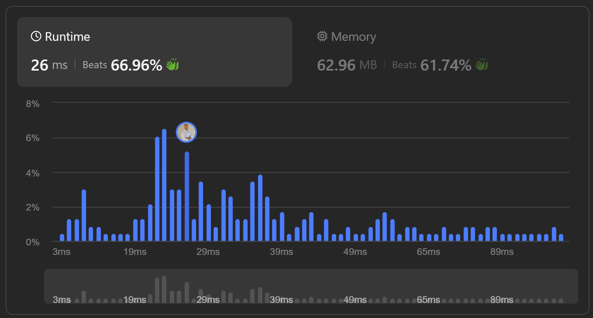
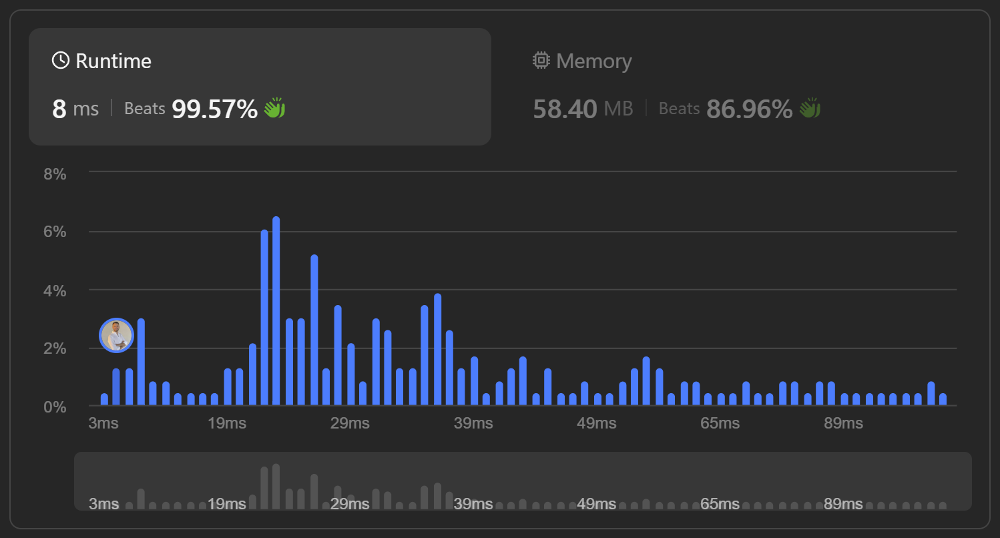

# 

I recently spent a good amount of time wrestling with a leetcode, I found a solution that to me seemed failry good only to submit it and find myself helpless in front of the results.



I had founded a solution to the problem, yes, but one that is just slightly better than the average.

Don't get fooled by the deceptive data visualization, I did better than 66.96%, it's true, but my program took 26ms! Which is almost 9 times the time taken by the fastest submissions.

This situation happens a lot to me and I feel forced to keep exploring and thinkering with the solution untill the solution plot looks like this:



Often that boils down to using a better approach but in this particular case, I reached a much better time by using a a concept which I had not heard before and that looks fascinating to me: Polynomial Rolling Hashes.

This was my gateway into esoteric hash functions.

# Array as a dictionary key

In .NET, Java and other languages, when an Array or a xxx are used a keys in a dictionary, the language treats them as Object and calculate the hash of the object not from the content of the array but from the identity of the object, in other words, from the memory address which the object occupies in memory.

So, for instance:

```cs
int[] first = [1, 2, 3], second = [1, 2, 3];
var dict = new dictionary<int[], int>;

dict[first] = 0;
dict[second];
```

Results in a xxxException. The first array and the second one have the same content but as they are not the same array, their hash function results in two different value.

A naive solution to this is to create a immutable representation of the content of the array and use that as key rather than the array itself:

```cs
int[] first = [1, 2, 3], second = [1, 2, 3];
var dict = new dictionary<string, int>;

dict[string.Join(first, ",")] = 0;
dict[string.Join(second, ",")];
```

This would work. But, it's not the most efficient approach.


Apart from that, if you are familiar with .NET you are probably screaming inside.

<details>
  <summary>If you are interested to know the problem with this approach in .NET, expand the accordion.</summary>
  This content is hidden until the user clicks the summary line above. You can include text, images, or even code blocks here.
</details>
